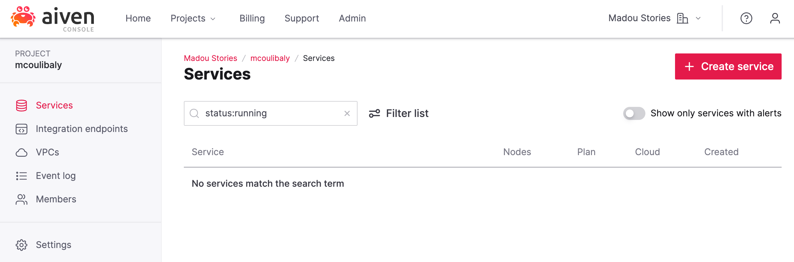
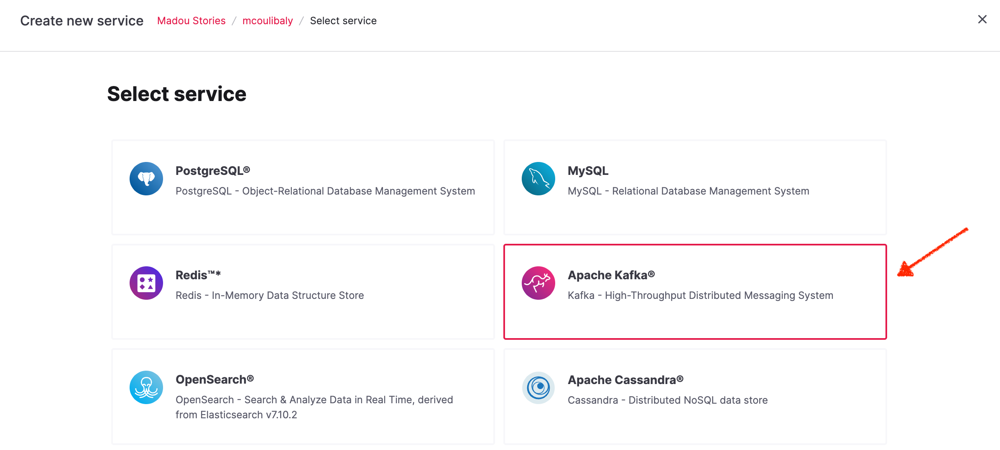
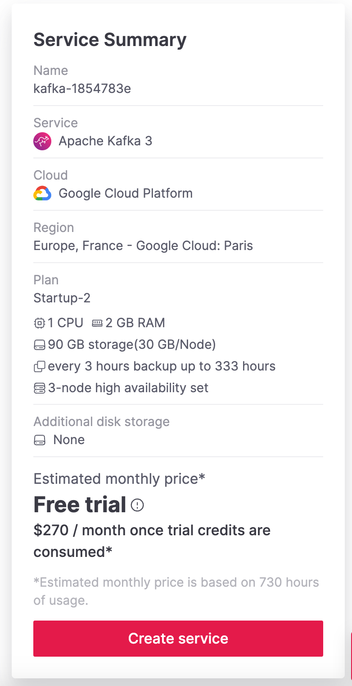
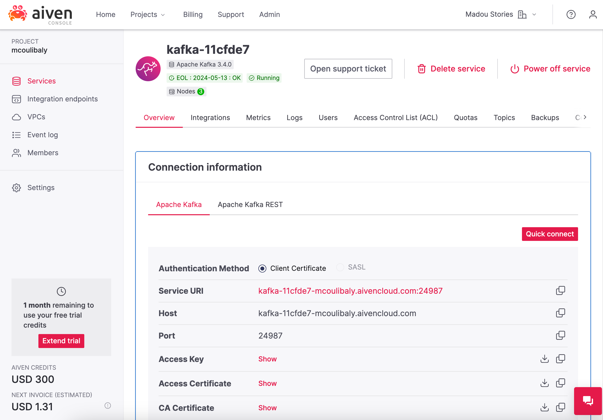
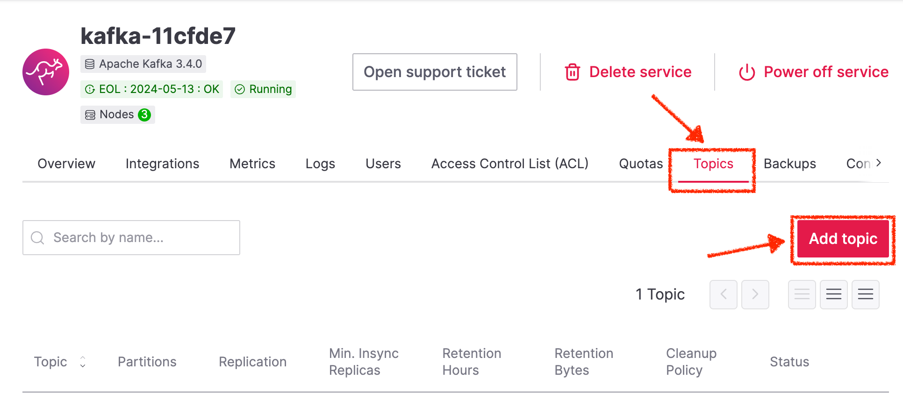
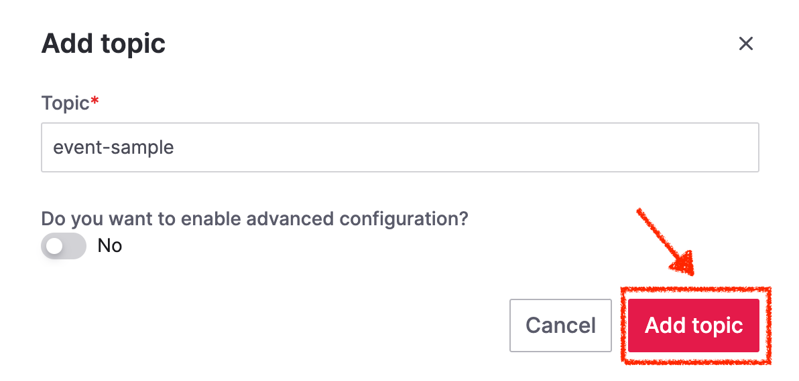
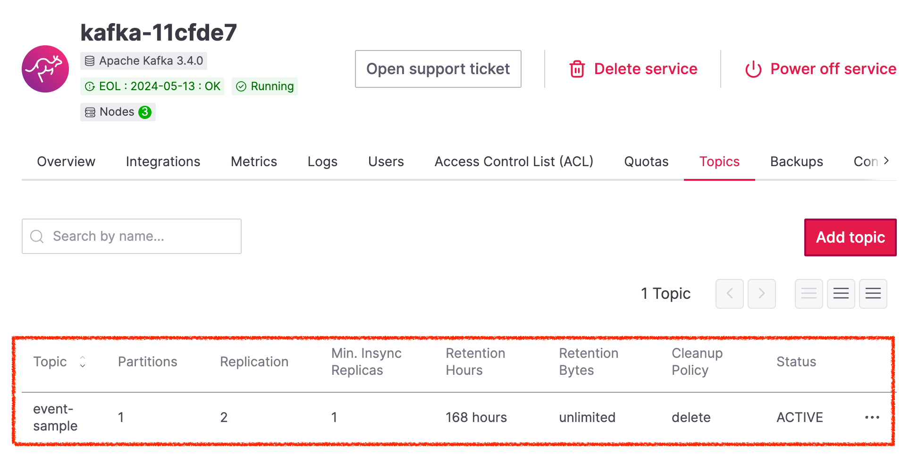
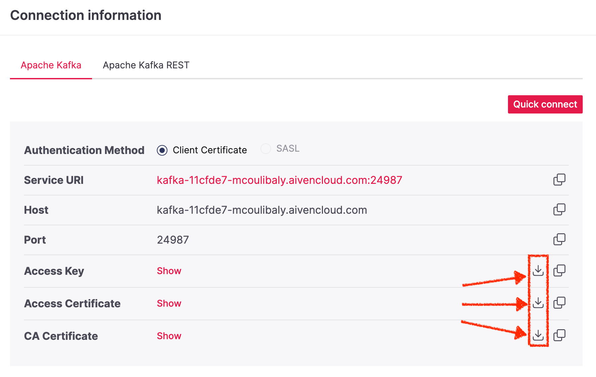

# Aiven Kafka Quickstart with Quarkus

This short tutorial will help you to get starting with Aiven Kafka and Quarkus. [Aiven Kafka](https://docs.aiven.io/docs/products/kafka) is a managed Kafka Service that provides easy deployment and management of Kafka clusters. [Quarkus](https://quarkus.io/) is a popular Java framework for building cloud-native applications.

You will be able to:
- Create an Aiven Kafka Service
- Configure a Quarkus application to interact with Aiven Kafka
- Produce messages using Aiven Kafka and Quarkus

## Prerequisites

Before you begin, make sure you have the following:

- **Aiven account**: Sign up for an account at https://console.aiven.io/signup if you don't have one.
- **Java Development Kit (JDK) 17 or later**: Install the JDK from https://adoptopenjdk.net/.
- **Apache Maven**: Install Maven by following the instructions at https://maven.apache.org/install.html.

## Create an Aiven Kafka Service

1. Log in to your Aiven account at https://console.aiven.io. 
2. Click on `+ Create Service` 

3. Select `Apache Kafka` from the list of services. 

4. Choose the desired `cloud provider`, `service region`, and `service plan` for your Kafka service
5. Provide the name of the service (e.g. kafka-xxxxx) and click `Create Service`

6. Your Aiven Kafka Service is now provisionned. Please save the `Connection information`. We will use them later.


## Create the Kafka Topic

1. From your Kafka service details, click on `Topics` tab and click on `Add topic`.

2. Provide the name of the topic (e.g. event-sample) and click `Add topic`

3. Your topic is now ready to receive data!


## Create keystore and truststore for Java

1. In your Kafka service details, click on `Overview` tab.
2. From the `Connection information`, download the necessary certificates `Access Key`, `Access Certificate` and `CA Certificate`.

3. Use the `openssl` utility to create the keystore with the `service.key` and `service.cert` files downloaded previously
```
openssl pkcs12 -export -inkey service.key -in service.cert -out client.keystore.p12 -name service_key
```
4. Enter a password to protect the keystore (`<KEYSTORE_PASSWORD>`) and the key (`<KEY_PASSWORD>`), when prompted
5. In the folder where the certificates are stored, use the `keytool` utility to create the truststore with the `ca.pem` file as input:
```
keytool -import -file ca.pem -alias CA -keystore client.truststore.jks
```
6. Enter a password to protect the truststores (`<TRUSTSTORE_PASSWORD>`) and reply yes to confirm trusting the CA certificate, when promted.
7. The result are the keystore named `client.keystore.p12` and truststore named `client.truststore.jks` that can be used for client applications configuration in the next steps.

## Configure Aiven Kafka in Quarkus

1. Clone the current repository: `git clone`
2. In `src/main/resources/application.properties`, configure the kafka connector outgoing channels as follows:
```
kafka.bootstrap.servers=<AIVEN_KAFKA_SERVICE_URI>
mp.messaging.outgoing.<TOPIC_NAME>.connector=smallrye-kafka
mp.messaging.outgoing.<TOPIC_NAME>.security.protocol=SSL
mp.messaging.outgoing.<TOPIC_NAME>.sasl.mechanism=PLAIN
mp.messaging.outgoing.<TOPIC_NAME>.ssl.key-password=<KEY_PASSWORD>
mp.messaging.outgoing.<TOPIC_NAME>.ssl.keystore.location=<KEYSTORE_FILE_PATH>
mp.messaging.outgoing.<TOPIC_NAME>.ssl.keystore.password=<KEYSTORE_PASSWORD>
mp.messaging.outgoing.<TOPIC_NAME>.ssl.truststore.location=<TRUSTSTORE_FILE_PATH>
mp.messaging.outgoing.<TOPIC_NAME>.ssl.truststore.password=tes<TRUSTORE_PASSWORD>
```
3. In `src/main/java/org/acme/kafka/producer/EventProducer.java`, define the <TOPIC_NAME> topic as the outgoing channel (`@Outgoing`) for the Producer  
```java
@Path("/events")
@ApplicationScoped
public class EventProducer {

    @POST
    @Path("/send")
    @Outgoing("<TOPIC_NAME>")
    @Produces
    public Multi<Record<String, Payload>> generate() {
        UUID uuid = UUID.randomUUID();
        String timestamp = Instant.now().toString();
        Payload payload = new Payload(timestamp
            , new Random().nextLong()
            , new Random().nextLong()
            , new Random().nextLong()
            , new Random().nextLong());
        return Multi.createFrom().item(Record.of(uuid.toString(), payload));
    }
}
```
4. Run the application in development mode `mvn quarkus:dev`. The output should be similar to:
```log
__  ____  __  _____   ___  __ ____  ______
 --/ __ \/ / / / _ | / _ \/ //_/ / / / __/
 -/ /_/ / /_/ / __ |/ , _/ ,< / /_/ /\ \
--\___\_\____/_/ |_/_/|_/_/|_|\____/___/
2023-07-04 17:54:45,216 WARN  [org.apa.kaf.cli.pro.ProducerConfig] (smallrye-kafka-producer-thread-0) These configurations '[ssl.key-password]' were supplied but are not used yet.

2023-07-04 17:54:45,220 INFO  [io.sma.rea.mes.kafka] (smallrye-kafka-producer-thread-0) SRMSG18258: Kafka producer kafka-producer-event-sample, connected to Kafka brokers 'kafka-11cfde7-mcoulibaly.aivencloud.com:24987 ', is configured to write records to 'event-sample'
2023-07-04 17:54:45,291 INFO  [io.quarkus] (Quarkus Main Thread) aiven-kafka-quickstart 1.0.0-SNAPSHOT on JVM (powered by Quarkus 3.1.3.Final) started in 1.680s. Listening on: http://localhost:8080
2023-07-04 17:54:45,292 INFO  [io.quarkus] (Quarkus Main Thread) Profile dev activated. Live Coding activated.
2023-07-04 17:54:45,292 INFO  [io.quarkus] (Quarkus Main Thread) Installed features: [cdi, kafka-client, resteasy-reactive, resteasy-reactive-jackson, smallrye-context-propagation, smallrye-reactive-messaging, smallrye-reactive-messaging-kafka, vertx]

--
Tests paused
Press [r] to resume testing, [o] Toggle test output, [:] for the terminal, [h] for more options>
```

## Send a message to Aiven Kafka

1. In your terminal, use curl to call the `/events/send` API
```
curl -X POST http://localhost:8080/events/send
```
2. In the Aiven console, go to `Services > Kafka-xxxxx > Topics > event-sample`
3. Click on the `Messages` button and click on `Fetch Messages`
4. You should see the messages produced by the Quarkus Application.


Congratulations!! 